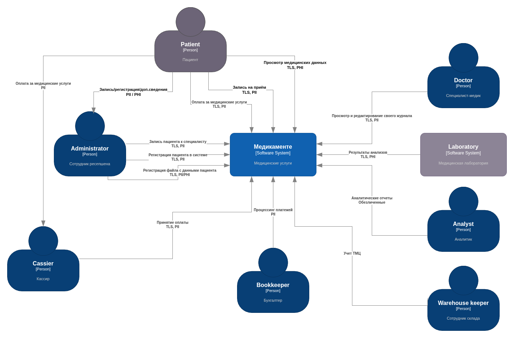
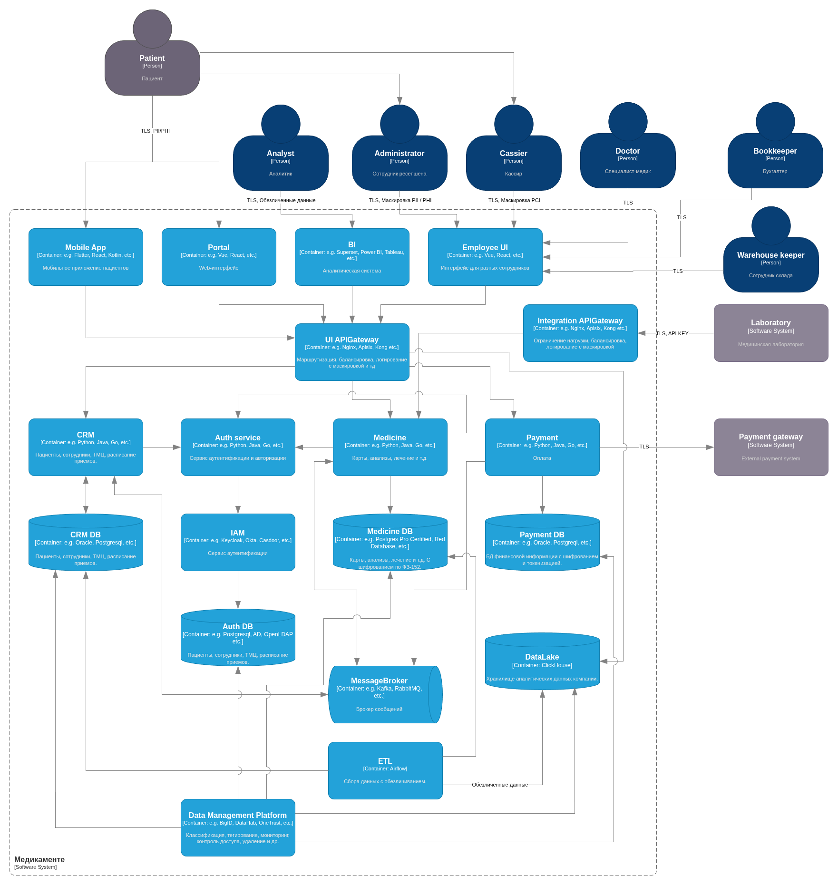

# Задание 2. Проектирование решения

## Диаграмма контекстов

Реализована в соответствии с заданием: "загрузите диаграмму контекста C4 целевого состояния системы".

## Диаграмма контейнеров

Реализована в связи с тем, что она лучше раскрывает реализацию PbD.

Аналитический слой: ETL в виде оркестратора задач (Airflow) и аналитической БД (ClickHouse):
  - требования позволяют периодический запуск так как не нужно оперативное обновление;
  - в задачах Airflow удобно реализовать шифрование/маскирование/обфускацию;
  - ClickHouse позволяют выставить TTL для реализации забвения;
  - ClickHouse позволяют реализовать сложные модели доступа к данным (например доступ по столбцам);
  - ClickHouse при помощи MaterializedView позволяет проводить деперсонализацию и агрегацию входных данных;
  - все компоненты поддерживают механизмы шифрования при передаче и хранении;
  - с помощью инструментов вроде OpenLineage, интегрированных в Airflow, можно четко отследить весь путь данных.

Employee UI и Medicine осознанно не разделены на более мелкие сервисы, чтобы уменьшить сложность взаимодействия компонентов в системе на ранних этапах разработки. Но по мере развития системы скорее всего нужно будет это сделать.

