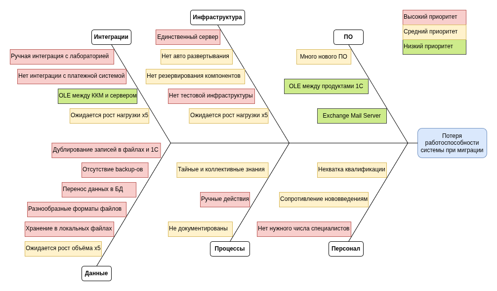

# Задание 4. Оценка узких мест при миграции

## Программное обеспечение

**Много нового ПО**  
*Чем опасно*: может вести к срыву сроков, ошибкам, потере данных и репутации.  
*Решение*: если для автоматизации процессов и усиления безопасности данных нужны новые сотрудники, руководство выделит необходимые ресурсы.  
*Приоритет*: средний.
*Комментарий*: большой объем работы, но текущими силами его не сделать, блокируется наймом сотрудников.

**OLE между продуктами 1С**  
*Чем опасно*: несет в себе критические риски так как OLE нужны админские права, с которыми она выполняет произвольный код на сервере.  
*Решение*: отказаться от этого механизма.  
*Приоритет*: низкий.  
*Комментарий*: для эксплуатации такой уязвимости нужны значительные усилия, что снижает вероятность такого сценария.

**Exchange Mail Server**  
*Чем опасно*: установленный на контроллере домена, является критической уязвимостью из-за низкой устойчивости к взломам, а также может вызывать повышенную нагрузку на сервер.  
*Решение*: вынести Exchange Mail Server на отдельный сервер или виртуальную машину.  
*Приоритет*: низкий.
*Комментарий*: угрозы взлома или DDoS не обозначены как приоритетные, однако долго игнорировать их не стоит.

## Инфраструктура

**Единственный сервер**  
*Чем опасно*: единая точка отказа.  
*Решение*: завести несколько серверов или переехать в облако.  
*Приоритет*: высокий.
*Комментарий*: возможные последствия слишком серьезны и даже не самая высокая вероятность падения не снижает приоритет.

**Нет авто развертывания**  
*Чем опасно*: критически сказывается на TTM, чем ухудшает репутацию.  
*Решение*: использовать оркестрируемый кластер.  
*Приоритет*: средний.
*Комментарий*: будет тормозить все, что будет создано, но к критическим проблемам не приведет.

**Нет резервирования компонентов**  
*Чем опасно*: потерей работоспособности, ведущей к финансовым и репутационным потерям.  
*Решение*:  использовать оркестрируемый кластер с возможностью масштабирования компонентов.  
*Приоритет*: средний.
*Комментарий*: проблемы с работой отдельных компонентов могут быть неприятны, но не имеют критических последствий.

**Нет тестовой инфраструктуры**  
*Чем опасно*: падением качества услуг, ведущим к потере репутации и финансов.  
*Решение*: заведение тестового контура, создания набора тестов.  
*Приоритет*: высокий.
*Комментарий*: тестирование на рабочем сервере / отсутствие тестирования / ошибки в runtime - неприятные следствия, а усилия на подъем тестового контура значительны => начинать лучше как можно раньше.

**Ожидается рост нагрузки x5**  
*Чем опасно*: отказ систем, падение производительности, ошибки в работе, ведущие к репутационным и финансовым потерям.  
*Решение*: проектирование системы с учетом масштабирования, проведение нагрузочного тестирования.  
*Приоритет*: средний.
*Комментарий*: нагрузку, несомненно, нужно учитывать начиная с проектирования, но она не случится мгновенно.

## Персонал

**Нет нужного числа специалистов**  
*Чем опасно*: может привести к срыву сроков, ошибкам, потере данных и репутации.  
*Решение*: если для автоматизации процессов и усиления безопасности данных нужны новые сотрудники, руководство выделит необходимые ресурсы.  
*Приоритет*: высокий.
*Комментарий*: новым сотрудникам нужно время на онбординг, на проведение которого очень мало человеческих ресурсов, материалов нет, потому делать это нужно как можно скорее.

**Сопротивление нововведениям**  
*Чем опасно*: ошибками, низкой эффективностью, проблемами с безопасностью, ведущими к репутационным и финансовым потерям.
*Решение*: мотивация и обучение персонала.  
*Приоритет*: средний.
*Комментарий*: снижает эффективность, но не блокирует работу.

**Нехватка квалификации**  
*Чем опасно*: задержками и ошибками в работе, ведущими к репутационным и финансовым потерям.
*Решение*: мотивация и обучение персонала.  
*Приоритет*: средний.
*Комментарий*: снижает эффективность, но не блокирует работу.

## Интеграции

**Ручная интеграция с лабораторией**  
*Чем опасно*: низкой производительностью, рисками безопасности, ошибками.  
*Решение*: реализация интеграции через API.  
*Приоритет*: высокий.
*Комментарий*: без этой интеграции не получится уйти от работы с файлами.

**Нет интеграции с платежной системой**  
*Чем опасно*: низкими безопасностью и производительностью, угрожающими финансовыми и репутационными потерями.  
*Решение*: создание интеграции с современным платежным шлюзом.  
*Приоритет*: высокий.
*Комментарий*: без этой интеграции не получится уйти от работы с файлами.

**OLE между ККМ и сервером**  
*Чем опасно*:  несет в себе критические риски так как OLE нужны админские права, с которыми она выполняет произвольный код на сервере.  
*Решение*: отказаться от этого механизма. 
*Приоритет*: низкий.  
*Комментарий*: для эксплуатации такой уязвимости нужны значительные усилия, что снижает вероятность такого сценария.

**Ожидается рост нагрузки x5**  
*Чем опасно*: отказом системы, ошибками в работе, низкой производительностью, ведущие к репутационным и финансовым потерям.  
*Решение*: проектирование системы с учетом ожидающихся нагрузок, проведение нагрузочного тестирования.  
*Приоритет*: средний.
*Комментарий*: нагрузку, несомненно, нужно учитывать начиная с проектирования, но она не случится мгновенно.

## Данные

**Хранение в локальных файлах**  
*Чем опасно*: неудобный формат для автоматизации работы и шифрования, создающий риски ошибок, утечек и потерь.  
*Решение*: работы с современными БД.  
*Приоритет*: высокий.
*Комментарий*: порождает много негативных сценариев, должен быть устранен в первую очередь.

**Разнообразные форматы файлов**  
*Чем опасно*: необходимостью реализовать логику под каждый формат.  
*Решение*: работы с современными БД.  
*Приоритет*: высокий.
*Комментарий*: блокирует миграцию на новую структуру данных в БД.

**Перенос данных в БД**  
*Чем опасно*: потерей данных, ведущими к финансовым и репутационным потерям.  
*Решение*: выбор удобного момента для выполнения миграции с сохранением резервированием данных.  
*Приоритет*: высокий.
*Комментарий*: технически сложный процесс, нуждающийся в валидации, блокирующий другие задачи.

**Отсутствие backup-ов**  
*Чем опасно*: потерей данных, ведущими к финансовым и репутационным потерям.  
*Решение*: заведение backup-ов.  
*Приоритет*: высокий.
*Комментарий*: последствия слишком серьезны, чтобы откладывать.

**Дублирование записей в файлах и 1С**  
*Чем опасно*: ошибками синхронизации, ведущими к финансовым и репутационным потерям.  
*Решение*: работы с современными БД вместо двух наборов файлов.  
*Приоритет*: высокий.
*Комментарий*: при наличии расхождений может блокировать миграцию от файлов к БД, либо вести к переносу ошибок в новую структуру.

**Ожидается рост объёма x5**  
*Чем опасно*: падением производительности.  
*Решение*: использование современной БД с механизмом репликации.  
*Приоритет*: средний.
*Комментарий*: нагрузку, несомненно, нужно учитывать начиная с проектирования, но она не случится мгновенно.

## Процессы

**Не документированы**  
*Чем опасно*: ошибками в обработке данных.  
*Решение*: создать источник истины в компании.  
*Приоритет*: средний.
*Комментарий*: снижает эффективность, но не блокирует работу.

**Ручные действия**  
*Чем опасно*: ошибками, рисками безопасности, ведущими к финансовым и репутационным потерям.  
*Решение*: автоматизация процессов.  
*Приоритет*: высокий.
*Комментарий*: один из основных источников рисков и проблем.

**Тайные и коллективные знания**  
*Чем опасно*: ошибками в обработке данных.  
*Решение*: аудит процессов в компании, создание источника истины.  
*Приоритет*: средний.
*Комментарий*: снижает эффективность, но не блокирует работу.