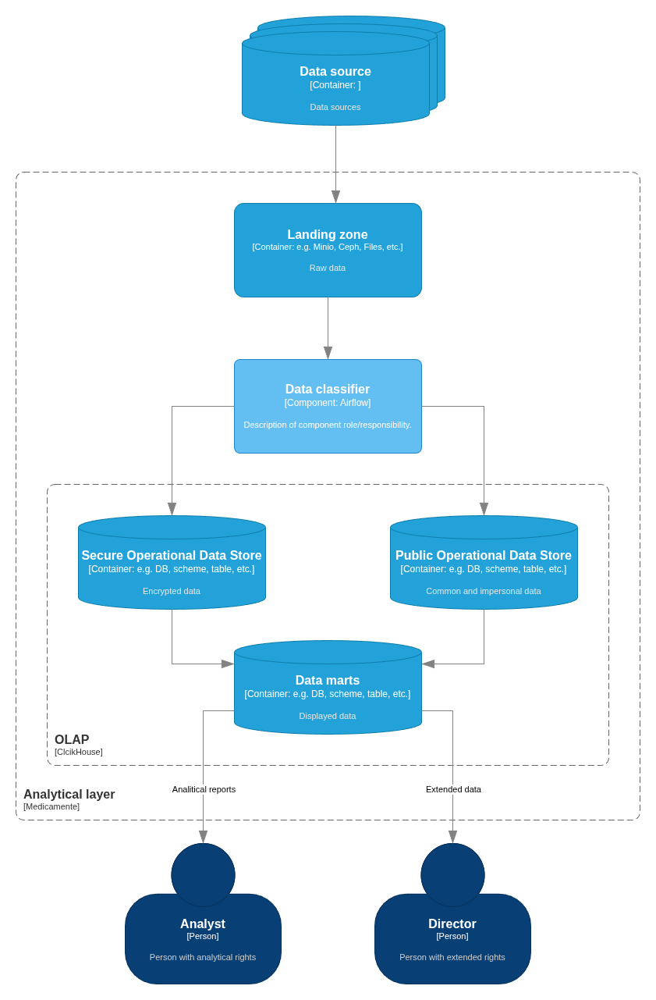

# Задание 6. Классификация данных

При выполнении [Задания 2](./../task2/README.md#диаграмма-контейнеров) уже был спроектирован слой, который обеспечивает аналитическую работу с данными системы с учётом принципов Privacy by Design.  
Он состоит из Airflow в роли оркестратора пайплайнов сбора данных и ClickHouse в качестве аналитического хранилища.  
[Диаграмма контейнеров](./../task2/diagrams/to-be-с4-containers.png).

Более подробная диаграмма с раскрытием структуры аналитического слоя PbD.

## Метрики классификатора

### Качество

**Precision**  
Доля полей, которые движок правильно назвал конфиденциальными, среди всех, которые он пометил защищенными. Высокая точность снижает избыточное шифрование общедоступных данных.

**Recall**  
Доля конфиденциальных полей, которые движок смог обнаружить, от общего числа реальных конфиденциальных полей в файле. Пропущенные чувствительные данные ведут к нарушению закона.

**F1-Score**  
Гармоническое среднее между Precision и Recall для комплексной оценки модели (показатель качества). Система должна предоставлять баланс между 

**False Negative Rate**  
Процент ложно-отрицательных данных. Пропущенные чувствительные данные ведут к нарушению закона.

**Quarantine Rate**  
Процент неклассифицированных данных. Слишком высокий говорит о неэффективности классификатора и необходимости доработки.

### Производительность и надежность

**Throughput**  
Количество обработанных записей за единицу времени (входящие данные для сохранения).

**RPS**  
Количество обработанных запросов на доступ к данным в секунду.

**Error Rate**  
Процент ошибок при работе в %.

**Availability**  
Доступность движка в %. 

## Производительность

Для поддержки производительности при росте объёма входящих данных:
- автомасштабирование в K8s по значению Throughput

Для поддержки производительности при росте числа запросов на доступ к данным можно применять:
- автомасштабирование в K8s по значению RPS
- кэширование предварительных расчетов в витрине дынных, а также самих отчетов при их повторении
- шардирование по датам
